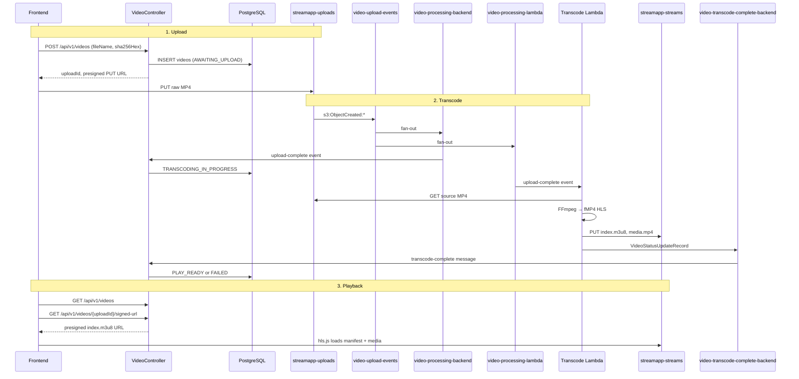
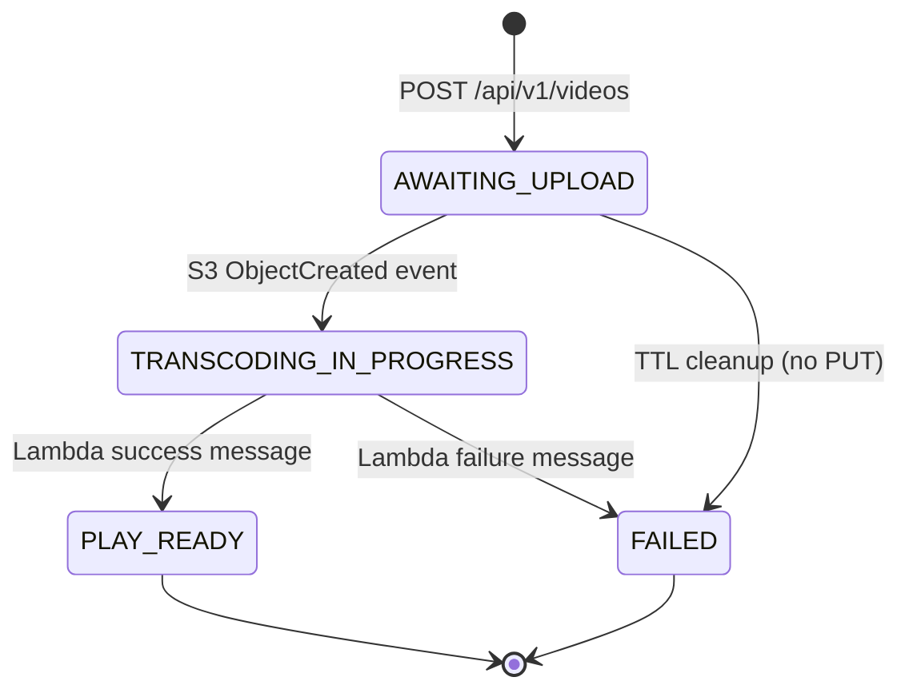

Uploading a video file is easy. Turning that upload into a streamable asset — tracking state across services, deduplicating by content hash, transcoding to a browser-friendly format, and serving it securely — is where things get interesting.

I have been building **stream-app**, a video upload and streaming platform, to work through that problem end to end. The stack is deliberately mainstream: Spring Boot on the backend, Vue 3 on the frontend, S3 for object storage, SNS/SQS for event fan-out, and a GraalVM-native Lambda for FFmpeg transcoding. This post walks through the architecture, the contracts that keep the pieces aligned, and the sharp edges I hit along the way.

## The Problem: Upload Is Not the Same as Playback

A naive approach stores the raw MP4 in a bucket and returns a download URL. That works for file delivery, but browsers want **HTTP Live Streaming (HLS)** for adaptive, seekable playback. HLS means a manifest file (`index.m3u8`) that references one or more media segments — and those segments must be reachable by the player after the manifest loads.

Meanwhile, the backend cannot afford to proxy multi-gigabyte uploads through itself. The standard pattern is **presigned URLs**: the API creates metadata in a database, hands the client a time-limited PUT URL, and the browser uploads directly to object storage.

That split — metadata in PostgreSQL, bytes in S3, processing in Lambda, playback in the browser — needs explicit contracts for object keys, status transitions, and message shapes. Without them, the upload bucket, transcode function, and frontend player drift apart quickly.

## End-to-End Architecture

The platform has three cooperating flows: **upload**, **transcode**, and **playback**.



Each upload gets a UUID **`uploadId`** that threads through every layer: database primary key, S3 prefix, SQS messages, and frontend playlist entries. Keeping that identifier stable and unique is the spine of the design.

## Shared Object-Key Conventions

The most important cross-service contract is **where files live in S3**. I centralized this in a single utility class used by the backend, Lambda, and tests:

```java
public final class S3ObjectKeys {

    public static final String PLAYLIST_FILE = "index.m3u8";
    public static final String MEDIA_FILE = "media.mp4";

    public static String uploadObjectKey(UUID uploadId, String fileName) {
        return uploadId + "/" + sanitizeFileName(fileName);
    }

    public static String streamPlaylistKey(UUID uploadId) {
        return uploadId + "/" + PLAYLIST_FILE;
    }

    public static String streamMediaKey(UUID uploadId) {
        return uploadId + "/" + MEDIA_FILE;
    }
}
```

| Bucket | Key pattern | Purpose |
|--------|-------------|---------|
| `streamapp-uploads` | `{uploadId}/{fileName}` | Raw client upload via presigned PUT |
| `streamapp-streams` | `{uploadId}/index.m3u8` | HLS manifest (playback entry point) |
| `streamapp-streams` | `{uploadId}/media.mp4` | Single fragmented MP4 (all HLS segments) |

Two buckets separate concerns: uploads are write-once client PUTs; streams are read-heavy playback assets produced by transcoding. Fixed output filenames (`index.m3u8`, `media.mp4`) mean the backend never needs extra database columns to locate HLS output — the key is always derivable from `uploadId`.

## Upload Flow: Presigned PUT and SHA-256 Deduplication

The upload API accepts a filename and a client-computed SHA-256 hash. The hash serves two purposes: **content deduplication** (reject duplicate uploads with `409 Conflict`) and integrity verification before the expensive transcode step.

```java
@Transactional(
        propagation = Propagation.REQUIRES_NEW,
        rollbackFor = DuplicateVideoUploadException.class)
public SignedUrlCreatedRecord createSignedUploadUrl(String fileName, String sha256Hex) {
    var uploadId = UUID.randomUUID();
    var shaHex = HexFormat.of().parseHex(sha256Hex);

    try {
        videoRepository.createPendingUploadEntry(uploadId, fileName, shaHex);
    } catch (DuplicateKeyException e) {
        throw new DuplicateVideoUploadException(fileName);
    }

    var signedUrl = s3Service.createSignedPutUrl(uploadId, fileName);
    return new SignedUrlCreatedRecord(uploadId, signedUrl, fileName);
}
```

The database row starts in `AWAITING_UPLOAD`. Only after the client finishes the S3 PUT does an event move it forward. If the client abandons the upload, a scheduled cleanup job marks stale rows as `FAILED` after a configurable TTL (default 30 minutes).

On the frontend, each file runs through an independent **state machine** inside a Vue composable:

1. **Hashing** — SHA-256 via Web Crypto API
2. **Creating** — `POST /api/v1/videos` for the presigned URL
3. **Uploading** — `PUT` to S3 with byte-level progress via XHR
4. **Complete** or **Failed** — per-file result with retry from hashing

```typescript
async function runUpload(id: string): Promise<void> {
  const item = getItem(id)
  if (!item) return

  try {
    updateItem(id, { phase: 'hashing', error: null, failedAtPhase: null })
    const digest = await sha256Hex(item.file)
    updateItem(id, { sha256: digest, phase: 'creating' })

    const signed = await createSignedUpload({
      fileName: item.file.name,
      sha256Hex: digest,
    })

    updateItem(id, { phase: 'uploading', uploadProgress: 0 })
    await putFileWithProgress(signed.signedUrl, item.file, (percent) => {
      updateItem(id, { uploadProgress: percent })
    })
    // ...
  } catch (error) {
    failItem(id, currentPhase, error)
  }
}
```

Multiple files upload in parallel; failures are isolated per queue item. API errors are parsed from RFC 7807 `ProblemDetail` JSON so the UI can show the backend's `detail` field instead of a generic HTTP status.

## Event-Driven Transcoding

When the raw MP4 lands in `streamapp-uploads`, S3 publishes an `ObjectCreated` event to an SNS topic. Two SQS queues subscribe to that topic:

| Queue | Consumer | Action |
|-------|----------|--------|
| `video-processing-backend` | Spring `@SqsListener` | `AWAITING_UPLOAD` → `TRANSCODING_IN_PROGRESS` |
| `video-processing-lambda` | GraalVM-native Lambda | Download, transcode, upload HLS output |

Fan-out through SNS means the backend and Lambda react to the same upload event without either service calling the other directly. The backend updates status; the Lambda does the heavy work.

After transcoding, the Lambda publishes a plain JSON message to `video-transcode-complete-backend`:

```json
{
  "uploadId": "550e8400-e29b-41d4-a716-446655440000",
  "status": "PLAY_READY"
}
```

The backend listener transitions `TRANSCODING_IN_PROGRESS` → `PLAY_READY` (or `FAILED` on error). Conditional updates in the repository prevent stale messages from overwriting a terminal state.

### FFmpeg: fMP4 HLS with a Single Media File

I chose **fragmented MP4 HLS** with the `single_file` flag. Instead of dozens of `.ts` or `.m4s` segment files, FFmpeg writes one `media.mp4` and an `index.m3u8` that references it relatively:

```java
public static List<String> build(String ffmpegPath, Path localInput, Path outputDir) {
    return List.of(
            ffmpegPath, "-y", "-i", localInput.toString(),
            "-vcodec", "libx264", "-preset", "fast", "-crf", "22",
            "-c:a", "aac", "-b:a", "128k",
            "-f", "hls",
            "-hls_time", "4",
            "-hls_playlist_type", "vod",
            "-hls_segment_type", "fmp4",
            "-hls_flags", "single_file",
            "-hls_segment_filename", localMediaFile.toString(),
            localManifest.toString());
}
```

This simplifies S3 layout (two objects per video instead of N+1) and makes local development easier. The trade-off is less granular CDN caching — acceptable for an early-stage VOD platform, but something to revisit if segment-level caching becomes important at scale.

The Lambda runs as a Spring Cloud Function (`Consumer<byte[]>`) compiled to a GraalVM native image. One lesson from that path: AWS's `SQSEvent` serializer does not populate records reliably in native images, so the handler parses raw SQS JSON with Spring Jackson instead.

## Playback: hls.js and the Presigned-URL Trap

The stream tab lists videos from `GET /api/v1/videos` and fetches a presigned GET URL for `index.m3u8` when the user selects a `PLAY_READY` video. **hls.js** loads the manifest, then requests `media.mp4` using a relative path.

Here is the catch: a presigned URL covers **one** S3 object. The manifest request carries the signature query string, but the relative `media.mp4` fetch does not. In production, this means CloudFront **signed cookies** scoped to `/{uploadId}/*`, or a backend media proxy — not a single presigned manifest URL on a private bucket.

| Environment | Approach |
|-------------|----------|
| Production | CloudFront signed cookies or a media proxy |
| Local dev (Floci) | Permissive read on `streamapp-streams` prefix + CORS |

For local development I use [Floci](https://floci.io/), an S3-compatible emulator running in Docker alongside PostgreSQL. An init script provisions the SNS topic, SQS queues, and S3→SNS notification — mirroring what AWS would provide in a real account.

The frontend polls the video list every four seconds while any video is `AWAITING_UPLOAD` or `TRANSCODING_IN_PROGRESS`, then stops when all items reach a terminal state (`PLAY_READY` or `FAILED`). That keeps the playlist fresh without websockets, which is fine for a dev/demo tool.

## Video Status as a State Machine

Every video row tracks one of four statuses:

| Status | Meaning |
|--------|---------|
| `AWAITING_UPLOAD` | DB row created; S3 PUT not yet confirmed |
| `TRANSCODING_IN_PROGRESS` | Upload landed; Lambda is working |
| `PLAY_READY` | HLS output exists; playback allowed |
| `FAILED` | Upload abandoned or transcode errored |



The signed stream URL endpoint enforces this: requesting a manifest for a non-ready video returns `409 Conflict` with a `video-not-ready` problem type, so the frontend never wastes a presign call on a video still transcoding.

## Local Development Stack

Getting the full pipeline running locally requires a specific startup order:

```bash
# 1. PostgreSQL
docker compose -f docker/infra/db/docker-compose.yaml up -d

# 2. Floci (local S3 + SNS/SQS init)
docker compose -f docker/infra/aws/docker-compose.yaml up -d

# 3. Backend (creates S3 buckets on startup)
cd backend && ./mvnw spring-boot:run -Dspring-boot.run.profiles=dev

# 4. Re-run AWS init if S3 notification was skipped
AWS_ENDPOINT_URL=http://localhost:4566 sh docker/infra/aws/init-aws-resources.sh

# 5. Frontend
cd frontend && npm install && npm run dev
```

The backend uses jOOQ with code generation driven by Testcontainers — Flyway migrations run against a real PostgreSQL 18 container at build time, not an H2 simulation. That matters because the `videos` table has a unique index on a `BYTEA` SHA-256 column, which H2 cannot model faithfully.

Integration tests spin up PostgreSQL and Floci together, bootstrap SNS/SQS/S3 resources in-process, and verify the full upload → listener → status transition path without mocking AWS.

## Trade-offs and What Comes Next

**What works well:**

- Presigned uploads keep the API out of the data path for large files
- SNS fan-out decouples status tracking from transcoding
- Shared `S3ObjectKeys` prevents key-layout drift across services
- SHA-256 deduplication catches re-uploads before transcode cost
- RFC 7807 errors give the frontend structured, human-readable failure messages

**What I would change or add:**

- **Authentication** — everything is open today; production needs auth on upload and playback
- **HLS segment auth** — CloudFront signed cookies before shipping to a private bucket
- **Adaptive bitrate** — current FFmpeg settings produce a single quality level; multi-rendition HLS is the next step
- **Websockets or SSE** — replace polling for transcode status in the UI
- **Dead-letter queues** — SQS DLQs for poison messages in the event pipeline

## Wrapping Up

Building a video platform is less about any single technology choice and more about **contracts**: stable object keys, explicit status transitions, and message shapes that every service agrees on before you write the first listener.

stream-app is still early — no auth, single-bitrate HLS, presigned-manifest playback that needs CloudFront for production — but the skeleton is sound. Presigned S3 uploads, event-driven transcoding, and a Vue frontend with a per-file upload state machine cover the hard parts of getting from "user picked an MP4" to "browser is playing HLS."

If you are starting a similar project, nail the object-key layout and status enum first. Everything else — FFmpeg flags, queue names, frontend polling — hangs off those two decisions.
