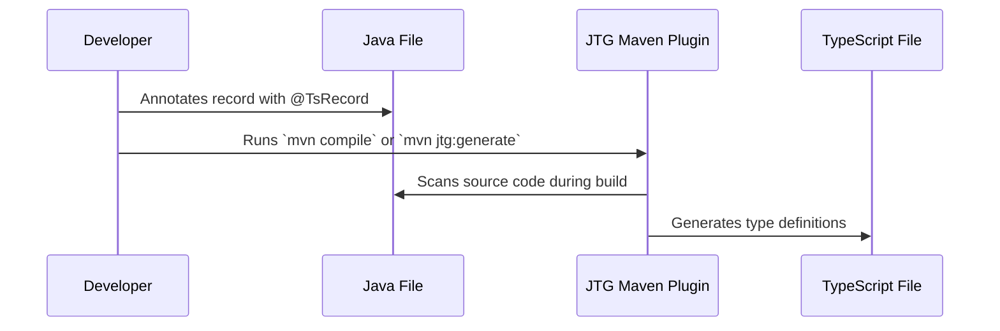

If you've ever worked on a full-stack application with a Java backend and a TypeScript frontend, you know the pain of keeping data models in sync. You define a beautifully structured DTO in Java, only to duplicate the exact same structure manually as an interface in your frontend codebase. It's tedious, error-prone, and a prime suspect for sneaky runtime bugs when an API contract changes.

To solve this, I built **Java-TS-Gen (JTG)**.

JTG is a developer-time Maven plugin that automatically generates TypeScript definitions directly from your Java `record`s. No complex build lifecycle integration required, and zero runtime configuration sprawl.

## How It Works

At a high level, JTG parses your source code for a specific annotation (`@TsRecord`) and spits out a ready-to-use `.ts` file right next to your Java source.

Here is a quick look at the workflow:



Because it uses `RetentionPolicy.SOURCE`, the annotation is completely invisible at runtime, meaning absolutely zero overhead for your production application.

## Quick Start Guide

Getting started is designed to be frictionless. Here is how to drop it into your existing Maven project.

### 1. Add the Dependencies

In your `pom.xml`, include the annotation library and the Maven plugin:

```xml
<dependencies>
  <!-- The annotation (zero runtime overhead) -->
  <dependency>
    <groupId>io.github.loomforge</groupId>
    <artifactId>jtg-annotation</artifactId>
    <version>0.1.0</version>
    <scope>provided</scope>
    <optional>true</optional>
  </dependency>
</dependencies>

<build>
  <plugins>
    <plugin>
      <groupId>io.github.loomforge</groupId>
      <artifactId>jtg-maven-plugin</artifactId>
      <version>0.1.0</version>
      <executions>
        <execution>
          <phase>generate-sources</phase>
          <goals>
            <goal>generate</goal>
          </goals>
        </execution>
      </executions>
    </plugin>
  </plugins>
</build>
```

### 2. Annotate Your Records

Just import the annotation and tag the records you want to expose to your frontend:

```java
import io.github.loomforge.jtg.annotation.TsRecord;
import java.util.UUID;

@TsRecord
public record User(String name, int age, boolean active, UUID id) {}
```

### 3. Generate!

JTG hooks right into the standard `generate-sources` phase. Anytime you build your app, your types are generated:

```bash
mvn compile
```

*(You can also run `mvn jtg:generate` at any time to invoke it manually.)*

**The Result:** A pristine `User.ts` file appears next to your `User.java`:

```typescript
// Generated by JTG
// Source: User.java
// Do not edit this file manually — changes will be overwritten.

export interface User {
  name: string;
  age: number;
  active: boolean;
  id: string;
}
```

## Customizing the Output

Sometimes, your backend naming conventions don't perfectly align with your frontend style guide. JTG provides options to mold the output to your needs.

If you prefer TypeScript `type` aliases over `interface`s, or want to rename the exported artifact, you can configure the `@TsRecord` annotation:

```java
@TsRecord(
    exportName = "UserDTO",   // Override the TypeScript identifier
    asType     = true         // Emit `type` alias instead of `interface`
)
public record User(String name, int age) {}
```

This will output:

```typescript
export type UserDTO = {
  name: string;
  age: number;
};
```

## Wrapping Up

Building Java-TS-Gen was an exercise in finding the path of least resistance for type safety across boundaries. By tying type generation to the build process and generating code precisely where the developer is looking, it removes the cognitive load of context-switching between backend definitions and frontend schemas.

If you are tired of manually updating TypeScript interfaces every time your backend changes, give JTG a try in your next full-stack Java project, and let the build tool do the heavy lifting!
